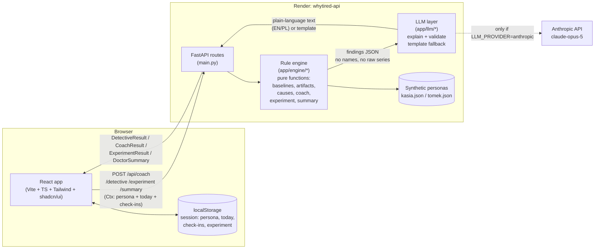

# WhyTired

**For active students and young adults in Poland who train regularly and feel tired without knowing why.**

WhyTired works in three steps:
- A 15-second morning check-in. A daily coach answers it with hard training, easy training or rest.
- When your energy stays low, a *detective mode* looks for likely causes in your own data and shows the evidence and how confident it is.
- It suggests one safe 7-day experiment. If the experiment does not help, it prepares a one-page summary in Polish for your family doctor (POZ).

Built at HackYeah 2026 (Sport & Healthcare).

## Architecture



The backend is stateless: every request carries the full context (persona, "today", logged check-ins, the active experiment) from the browser's `localStorage`, so the free Render API can sleep and wake up without losing anyone's demo. The rule engine is plain Python, no I/O, one small function per rule, and it is the only place that computes numbers. The LLM only turns those numbers into a sentence or two, in English or Polish, and a validator rejects any text that invents a number or mentions a diagnosis, medication or lab test — it falls back to a template if so, or if there is no API key at all.

## Run locally
```bash
# Backend (Python 3.12 via uv)
cd backend
cp .env.example .env        # LLM_PROVIDER=none works without an API key
uv run uvicorn app.main:app --reload    # http://localhost:8000/api/health

# Frontend (in another terminal)
cd frontend
npm install
npm run dev                 # http://localhost:5173 (proxies /api to :8000)
```

Tests: `cd backend && uv run pytest`

Demo data (synthetic, deterministic): `cd backend && uv run python -m scripts.generate_personas`

Before the demo, rehearse the whole flow on the live site (Chrome needed):
`node scripts/e2e-demo.mjs https://whytired-vnvu.onrender.com /tmp/whytired-e2e`

## Demo walkthrough

The DemoPanel (desktop: right of the phone frame; mobile: a button that opens a bottom sheet) switches persona, moves "today" forward, and switches the data level and scenario — this is how the whole story below is driven live, with no need to wait out real days.

1. **Onboarding → check-in → coach (persona Kasia, full data).** Set a goal and sports, confirm the watch is connected, then answer the 15-second morning check-in. The Today screen shows one word — hard / easy / rest — with one-line reasons (training load, sleep, resting HR vs. baseline) and, if a planned session is too long, an injury-risk warning.
2. **Detective mode.** After several low-energy mornings, "Find out why" ranks the candidate causes (training load spike, sleep debt, stress spike, elevated resting heart rate) with evidence from Kasia's own data, a confidence level (high/medium/low, always shown with an icon and a label, never colour alone), and the data level the finding relies on. The artifact night (an implausible overnight heart-rate jump) is excluded from the evidence with a plain-language reason.
3. **Start the experiment.** The top cause proposes one concrete 7-day change (here, cut training load by 40% and log resting heart rate each morning). Starting it is the one primary action on the screen.
4. **Time travel +7 days.** The DemoPanel jumps "today" forward a week. In the `not_improved` branch energy did not recover, so the app prepares a one-page doctor summary in Polish: a complaint timeline, small trend charts, what was tried and its result, and a fixed list of questions to ask the doctor — no diagnoses, no recommended tests. "Print → Save as PDF" and a share button (a read-only link plus a QR code) are both tested by `scripts/e2e-demo.mjs`.
5. **Switch persona to Tomek (no watch, basic data level).** The same detective mode runs on check-ins and manually logged sessions only. A note above the causes explains that without a watch no finding can go above medium confidence, and the ranked cause (sleep debt during exams, in his story) is shown exactly the same way, just capped lower.

## Repository
| Path | What |
|---|---|
| `backend/app/models.py` | Shared data + API contract |
| `backend/app/engine/` | Rule engine: small pure functions, one per rule |
| `backend/app/llm/` | Plain-language explanations with validation and template fallback |
| `backend/scripts/` | Synthetic persona generator |
| `frontend/` | Vite + React + TypeScript + Tailwind + shadcn/ui |
| `docs/PLAN.md` | Build plan, rules, timeline, ownership |
| `docs/DECISIONS.md` | Architecture decisions |
| `docs/DISCLOSURE.md` | AI tools, APIs, libraries, research sources, data statement |

## Team workflow
- `main` is the live demo: every push deploys on Render (static site + API, see `render.yaml`). Run `uv run pytest` and `npm run build` before pushing.
- Boran pushes to `main` directly. Berken works on `feature/<topic>` and opens a PR, and Boran merges it.
