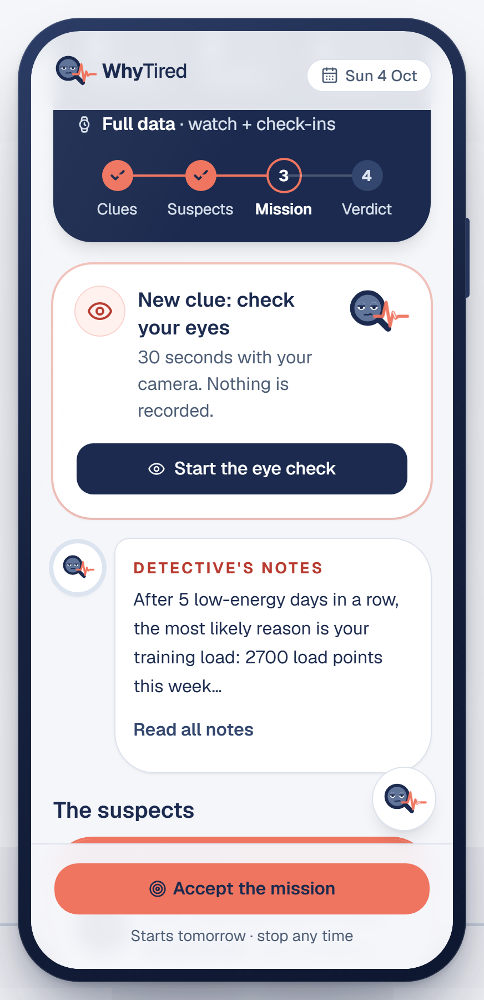
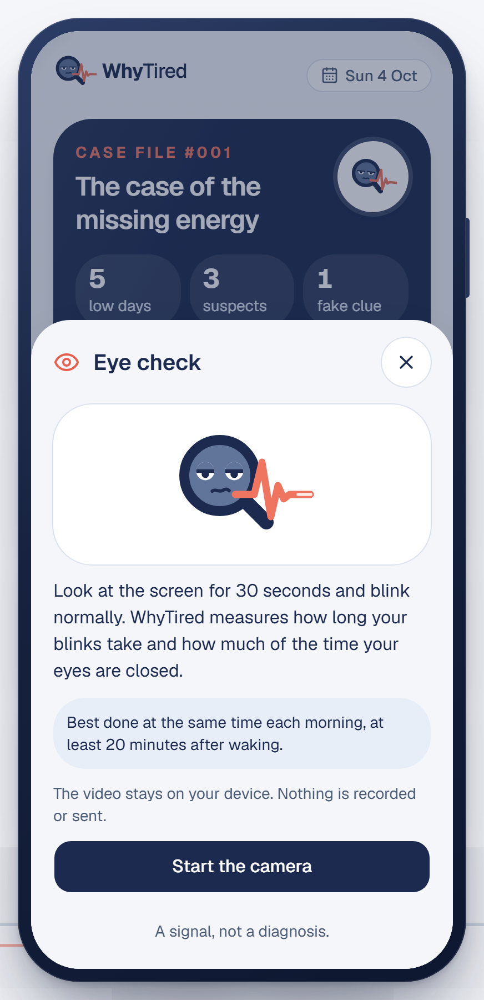
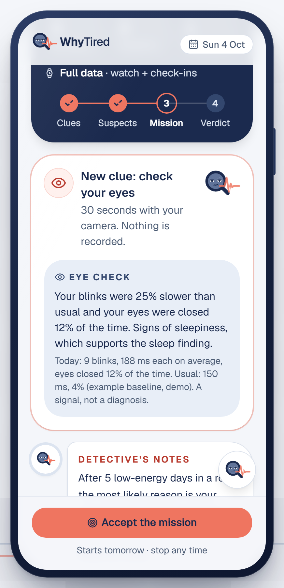
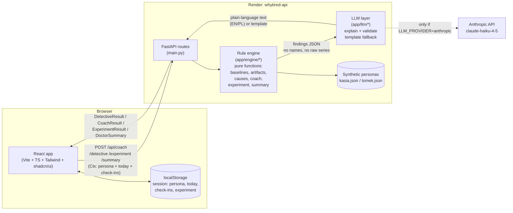
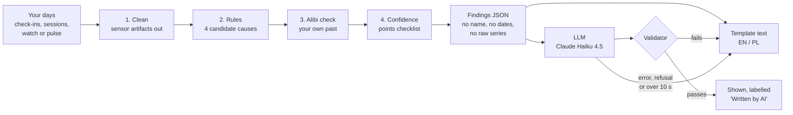

# WhyTired

**For active students and young adults in Poland who train regularly and feel tired without knowing why.**

WhyTired works in three steps:
- A 15-second morning check-in. A daily coach answers it with hard training, easy training or rest.
- When your energy stays low, a *detective mode* looks for likely causes in your own data and shows the evidence and how confident it is.
- It suggests one safe 7-day experiment. If the experiment does not help, it prepares a one-page summary in Polish for your family doctor (POZ).

Built at HackYeah 2026 (Sport & Healthcare).

**Live demo:** https://whytired-vnvu.onrender.com (desktop Chrome works best). Start with **Take the 2-min tour**. The API runs on a free plan that sleeps when idle; a scheduled GitHub Action pings it every 5 minutes to keep it awake, and if it still fell asleep, the first screen that needs it can take up to a minute. All data is synthetic: two fictional personas.

## Screenshots


| Morning coach | Detective mode | Experiment result | Doctor summary (PL) |
|---|---|---|---|
|  |  |  |  |

All screens are in `docs/screenshots/`. To regenerate them with both servers running locally, run `node scripts/screenshots.mjs http://localhost:5173 docs/screenshots`.

## Eye check: a new clue from your camera

When sleep or stress is a suspect, the detective asks for one more clue: 30 seconds in front of the camera. WhyTired measures how you blink and compares it with your usual. The result joins the case as extra evidence. It never changes a suspect's rank or confidence.

<table>
  <tr>
    <td align="center" width="33%"></td>
    <td align="center" width="33%"></td>
    <td align="center" width="33%"></td>
  </tr>
  <tr>
    <td align="center"><b>1. A new clue</b><br>A card under the case file offers the check. The sleep and stress suspects also have "Check it yourself".</td>
    <td align="center"><b>2. 30 seconds, on the device</b><br>Look at the screen and blink normally. Best at the same time each morning.</td>
    <td align="center"><b>3. Evidence for the case</b><br>The result shows on the card and on the matching suspect. A signal, not a diagnosis.</td>
  </tr>
</table>

| Measure | What we compute | Why it matters |
|---|---|---|
| **Blink duration** | The average length of a blink (eyes more than half closed for 50–500 ms) | Blinks get longer when you are sleepy (Caffier et al., 2003) |
| **PERCLOS** | The share of the 30 seconds with the eyes more than 80% closed | A standard measure of drowsiness (Dinges & Grace, 1998) |
| **Blinks** | How many blinks | Shown for context |

Either measure more than 10% above your usual reads as a sign of sleepiness. How open the eyes are in each frame is the eye aspect ratio (Soukupová & Čech, 2016), computed from the eye points that MediaPipe Face Landmarker finds. The math is in `frontend/src/components/evidence/logic.ts`, with a self-check: `node frontend/src/components/evidence/logic.check.ts`.

> [!NOTE]
> **Nothing is recorded or sent.** The video never leaves the browser. The face model ships with the app (`frontend/public/models/`), and `@mediapipe/tasks-vision` is pinned to 0.10.21 because later versions send usage logs to Google (DECISIONS D22). The camera turns off as soon as the check ends. The "usual" values are an example baseline per persona (demo).

No camera, camera access denied, or no face found? The app says what happened and offers **Show demo result**, so the demo never gets stuck. To open the check directly: Presenter tools → Jump to → **Eye check**.

## Architecture



The backend is stateless: every request carries the full context (persona, "today", logged check-ins, the active experiment) from the browser's `localStorage`, so the free Render API can sleep and wake up without losing anyone's demo. The rule engine is plain Python, no I/O, one small function per rule, and it is the only place that computes numbers. The LLM only turns those numbers into a sentence or two, in English or Polish, and a validator rejects any text that invents a number or mentions a diagnosis, medication or lab test — it falls back to a template if so, or if there is no API key at all. The details are in [How the detective decides](#how-the-detective-decides-rules-first-ai-second), [The AI layer](#the-ai-layer-it-explains-it-never-decides) and [The data](#the-data-synthetic-deterministic-built-to-test-every-rule).

## How the detective decides: rules first, AI second

WhyTired is a health app, so every finding has to be explainable and repeatable. All numbers, causes, rankings and confidence levels come from the rule engine (`backend/app/engine/`). It is made of small pure Python functions with no I/O, one per rule, and each one has a comment that gives its threshold and, where there is one, the research behind it. The LLM has a single job: it turns the finished findings into two to four plain sentences. The app works fully without it.



### 1. Leave out what the watch got wrong
`artifacts.py` runs before any rule. Each reading it removes is listed on the detective screen with a plain reason.

| Excluded when | In the demo |
|---|---|
| Resting HR is below 30 or above 120 bpm | — |
| Resting HR moved more than 25 bpm from both the last valid reading and the median of the last 7, and the check-in did not change (energy or stress by 2+ points) | Kasia, 24 Sept: 88 bpm, a 31 bpm jump with a normal check-in. "Most likely a measurement error, e.g. a loose strap." |
| The watch recorded less than half of the night, or the heart rate during sleep was above the daytime average | The same night: only 35% recorded |

Training alone never explains a 25+ bpm overnight jump. Feeling much worse (e.g. getting ill) does, so a real rise is never hidden (DECISIONS D10).

### 2. Four candidate causes, each against your own usual
Detective mode starts after 3 low-energy mornings in a row (energy 1–2 out of 5). Every rule compares the last 7 days with the 28 days before them. Training load uses the median of the 4 previous weeks instead, so one holiday week cannot distort "usual" (D11).

| Cause | Fires at | Strong at | Needs | Based on |
|---|---|---|---|---|
| Training load spike | ≥ 1.3× your usual week | ≥ 1.5× | Logged sessions: minutes × effort 1–10 | Session-RPE load, Foster et al. 2001 |
| Sleep debt | ≥ 4 h short over 7 days | ≥ 7 h | Check-in sleep hours (watch sleep when available) | Your own sleep average |
| Stress spike | ≥ 1 point above usual (1–5 scale) | ≥ 1.5 | Check-ins | Self-reported measures track training strain, Saw et al. 2016 |
| Resting HR up | ≥ 5 bpm above usual | ≥ 8 bpm | Watch, or the tap-along morning pulse | Your own resting HR baseline |

The daily coach uses the same baselines (D12): 0 red flags means hard, 1–2 easy, 3+ rest. "I feel ill" always means rest, and there are never two hard days in a row. A planned session more than 10% longer than your longest one in the last 30 days gets an injury-risk warning (Frandsen et al., BJSM 2025). The study measured running distance; we use duration so the rule also works for gym and team sports (D8).

### 3. The alibi check: does your own past agree?
For each cause the engine finds the past week with the least of that factor (your lightest training week, best-sleep week or calmest week), leaving out the last 14 days, and compares it with all your other past days. If your energy was at least 0.5 points higher that week, or your resting HR at least 3 bpm lower, your history supports the cause. Kasia's lightest week was her holiday (5–11 Aug): energy +1.1, resting HR −6 bpm.

### 4. Confidence you can check line by line
Each suspect shows its confidence as a checklist, not as an unexplained score.

| Check | Points |
|---|---|
| The rule fires: a clear change compared with your usual | +1 |
| The change is strong | +1 |
| Your own history supports it (step 3) | +1 |
| Body measurements back it up: resting HR up ≥ 3 bpm or HRV ≤ 90% of usual (for sleep: the watch measured it) | +1 |
| Fewer than 70% of this week's days have the data | −1 |

4 or more points is **high**, 2–3 is **medium**, 0–1 is **low**. Without a watch or pulse the fourth point cannot be earned, so the Basic level is capped at medium: less data visibly means less certainty. The level is always written out with an icon, never shown by colour alone.

| Data level | Who | What the rules see | Best possible confidence |
|---|---|---|---|
| Basic | No watch | Check-ins + logged sessions | Medium |
| Medium | Phone | + step count + tap-along morning pulse | High |
| Full | Smartwatch | + resting HR, HRV and sleep from the watch | High |

The level is applied to each request (`store.restrict_to_level()` hides the fields that level does not have), so the rules never branch on "has a watch", and no-watch mode also works on Kasia's data.

### 5. Did the experiment work?
After 7 days the engine compares energy on days 4–7 (the body needs a few days to respond) with the 5 days before the start. **Improved** means energy at least 1 point higher and, if resting HR is measured, back within 3 bpm of usual. With fewer than 5 check-ins in 7 days the app says it cannot tell, instead of guessing. The experiment starts at a low point, so some recovery may come on its own; an "improved" result is therefore worded as a pattern, not as proof.

### What it finds on demo day (4 Oct 2026)
This is the real output of `POST /api/detective` for both personas:

| | Kasia: runner, watch (Full) | Tomek: gym, no watch (Basic) |
|---|---|---|
| Low-energy mornings | 5 | 4 |
| Prime suspect | Training load: **2700** vs usual **1050** load points, trained 6 of 7 days. **High** | Sleep debt: **5.3** vs usual **7.0** h a night, **11.9 h** short. **Medium**, check-ins only |
| Other suspects | Resting HR 61 vs 54 bpm (medium) · Sleep 6.6 vs 7.3 h (medium) | Stress 4.3 vs 2.7 out of 5 (medium) |
| Alibi check | Holiday week: energy +1.1, resting HR −6 bpm | Summer break: energy +1.0 |
| Left out | 24 Sept, loose strap (resting HR and sleep) | Nothing |
| Mission | Cut training load by 40% for 7 days | Protect a fixed sleep window for 7 days |

## The AI layer: it explains, it never decides

**Where the LLM writes.** It writes in two places only: the detective notes (English) and the "In short" paragraph at the top of the doctor summary (Polish or English). Everything else is fixed copy from code: the coach's reasons, evidence lines, experiment plans, the questions for the doctor and the disclaimer. Polish detective notes always use the template. In testing, Claude Haiku's Polish there was ungrammatical and flipped the logic of the alibi check, while the hand-written Polish reads well.

**What it receives.** `explain.py` builds a JSON of computed findings from a whitelist, so a new engine field can never leak by accident. The JSON has no name and no dates (dates inside engine sentences, such as "5–11 Aug", are stripped too), no raw time series and no chart points. Directions are spelled out in the key names (`energy_higher_that_week`). An earlier version let the model guess which week was compared, and it wrote the opposite of the finding.

<details>
<summary>The exact payload for Kasia, trimmed to the top cause</summary>

```json
{
 "low_energy_days": 5,
 "data_level": "full",
 "causes": [
  {
   "id": "load_spike",
   "title": "Your training load jumped",
   "confidence": "high",
   "evidence": [
    {"text": "Last 7 days: 2700 load points, against your usual 1050 a week.", "value": 2700.0, "baseline": 1050.0, "unit": "load points"},
    {"text": "You trained on 6 of the last 7 days (usually 4).", "value": 6.0, "baseline": 4.0, "unit": "days"}
   ],
   "history": {
    "compared_week": "your lightest training week (your holiday week)",
    "compared_with": "your normal days",
    "supports_this_cause": true,
    "energy_higher_that_week": 1.1,
    "resting_hr_lower_that_week": 6.0
   }
  }
 ],
 "excluded_nights": 1,
 "experiment": "Cut your training load by 40% for 7 days"
}
```

The real payload also holds the second and third causes (resting HR, sleep debt) in the same shape.
</details>

**What it is told.** The system prompt (`explain.py`) says: keep the engine's ranking and confidence; use only numbers from the findings and calculate nothing new; never diagnose; never mention medication, supplements or lab tests; mention heart data only if the findings contain it; use plain, calm language. Polish answers must use gender-neutral forms.

**What the answer must pass.** The checks are in `validate.py` and `explain._acceptable()`. If any one fails, the template is shown and the reason is logged.

| Check | Catches |
|---|---|
| Every number in the text exists in the input JSON. Decimal commas and thousands separators are normalised, and only rounding of a real value is allowed (12.5 may be 12,5, 13 or 12; 7.1 is never 8) | Invented or recalculated numbers |
| Blocked terms in English and Polish, whole words only: diagnoses ("you have", "syndrome", "overtraining", "anaemia"…), medication and supplements, lab and blood tests | Diagnoses, medication, test advice |
| Heart rate, HRV or pulse only if the input mentions them, and never at the Basic level | Talking about a watch the user does not have |
| At most 700 characters (detective) or 900 (summary) | Rambling |
| Polish requested → the text must contain Polish letters | The wrong language |
| Provider problems: refusal, cut-off or empty answer, no key, no credits, over 10 s | A demo that hangs |

A real rejection, checked against Kasia's payload above:

> "Your training load rose to 2800 load points. You have overtraining syndrome, so ask for a blood test and take magnesium."
>
> → `blocked term 'You have'`, `'overtraining'`, `'syndrome'`, `'magnesium'`, `'blood test'`, `numbers not in the input: ['2800']`. The template is shown instead.

The checks are strict on purpose, because a false alarm only costs a template. Every template passes the same validator in the tests, so the fallback is always safe as well.

**What the user sees.** LLM text carries a label: "Written by AI from our numbers. Every number in it is checked." On the doctor's page it reads "W skrócie (tekst napisany przez AI wyłącznie na podstawie liczb z tego podsumowania)". Template text has no label, because a person wrote it.

**Setup** (`providers.py`, DECISIONS D9):

| Variable | Default | Notes |
|---|---|---|
| `LLM_PROVIDER` | `anthropic` | `ollama` for a local model, `none` for templates only. `.env.example` sets `none`, so the app runs without a key. |
| `ANTHROPIC_MODEL` | `claude-haiku-4-5` | The fastest Claude model. Each attempt has 8 s, with one retry and a hard 10 s limit for the whole call. |
| `ANTHROPIC_API_KEY` | — | Only in `backend/.env` or the Render dashboard, never in git |
| `OLLAMA_MODEL`, `OLLAMA_URL` | `gemma3:4b`, `http://localhost:11434` | For offline development; the data stays on the laptop |

Validated answers are cached in memory by a hash of the prompt, so switching screens is instant and costs nothing. `GET /api/health` shows the active setup, e.g. `anthropic/claude-haiku-4-5`, or `anthropic/claude-haiku-4-5 (no API key, templates only)`.

**Tested.** `backend/tests/test_llm.py` covers the validator (invented numbers, blocked terms in both languages, whole-word matching) and the fallback for every failure (no key, refusal, timeout, a bad answer, an English answer to a Polish request). It also checks that names, dates and chart points never reach the payload, and that both demo personas get safe explanations. The whole backend suite has 178 tests: `cd backend && uv run pytest`.

## The data: synthetic, deterministic, built to test every rule

No real person's data is used anywhere. Each of the two fictional personas has 90 days of history (7 Jul – 4 Oct 2026) plus two 14-day futures, `improved` and `not_improved`. Time travel moves "today" into one of them.

- **Generated, not hand-written.** `backend/scripts/generate_personas.py` (standard library only) writes `backend/data/kasia.json` and `backend/data/tomek.json` and validates them against the Pydantic `PersonaFile` model. Fixed seeds make every run byte-identical, and a test checks this. To change the story, edit `CONFIG` at the top of the script and regenerate; never edit the JSON by hand.
- **Every story beat is there to exercise a rule:**

  | Story beat | Persona | Rule it exercises |
  |---|---|---|
  | Training ramps from 4 to 6 runs a week from 21 Sept, with a 110-min long run on 3 Oct | Kasia | Load spike, injury-risk warning |
  | Holiday week 5–11 Aug, resting HR down to about 48 | Kasia | Alibi check with watch data |
  | Loose strap on 24 Sept: 88 bpm, 35% of the night recorded, normal check-in | Kasia | Artifact exclusion |
  | Late coffee on her last 5 evenings, 40 min less sleep each | Kasia | Sleep debt as a second, weaker suspect |
  | Retake exams from 23 Sept: 5–6 h nights, high stress, one gym session dropped | Tomek | Sleep debt and stress, and a load spike that must **not** fire |
  | Summer break 15–21 Aug with long nights | Tomek | Alibi check without a watch |
  | A few forgotten check-ins | Both | The 70% coverage rule |

- **Shaped like real tracking.** Each day holds the 5-question check-in plus "I feel ill" and the logged sessions (sport, minutes, effort 1–10). It can also hold phone steps, a manual pulse and watch values (resting HR, HRV, sleep minutes, share of the night recorded, sleep and daytime HR). A real watch export would map onto the same model (`backend/app/models.py`).
- **Your check-ins win.** A check-in logged in the app replaces the synthetic one for that day, so the demo reacts to what you tap.
- The full persona numbers, ready for slides, are in [docs/PERSONAS.md](docs/PERSONAS.md).

## What we do not claim
- The thresholds are transparent heuristics, based on the sources above and the team's judgement. They are not a clinically validated model. They sit as named constants at the top of each engine file, so they are easy to review and change.
- Synthetic data shows that the logic works end to end. It does not measure accuracy on real people.
- WhyTired does not diagnose and does not recommend medication or tests. The doctor summary is a conversation aid for the family doctor (POZ).
- The number check covers digits. Number words such as "tripled" are not checked; the system prompt forbids new numbers, and the ranking and confidence never come from the LLM.

## Run locally
Needs [uv](https://docs.astral.sh/uv/) (it installs Python 3.12 for you) and Node 22.

```bash
# Backend (Python 3.12 via uv)
cd backend
cp .env.example .env        # LLM_PROVIDER=none works without an API key
uv run uvicorn app.main:app --reload    # http://localhost:8000/api/health

# Frontend (in another terminal)
cd frontend
npm install
npm run dev                 # http://localhost:5173 (proxies /api to :8000)

# Or both in one terminal, from the repo root (Ctrl+C stops both)
node scripts/dev.mjs
```

Tests: `cd backend && uv run pytest`

Demo data (synthetic, deterministic): `cd backend && uv run python -m scripts.generate_personas`

Before the demo, rehearse the whole flow on the live site (Chrome needed):
`node scripts/e2e-demo.mjs https://whytired-vnvu.onrender.com /tmp/whytired-e2e`

And every path a presenter might take (restart, skipping onboarding, both personas, both outcomes):
`node scripts/demo-sweep.mjs https://whytired-vnvu.onrender.com`

## Demo walkthrough

**The 2-minute tour.** On desktop the first screen is a welcome beside the phone with one action: **Take the 2-min tour**. It steps through every screen with one caption each (Next / Back, the arrow keys or a clicker): Kasia (watch) first, then Tomek (no watch, including the eye check and the tap-along pulse), the doctor's page, and the "case closed" ending. It ends with "Try it yourself" or "Watch again". On a phone the tour is a bar above the app.

**On your own.** Tap *Get started* in the phone. A demo tip on the first check-in question says which answer opens the detective, and on the mission screen *Demo: skip to day 7* shows the verdict without waiting a week.

**Presenter tools** (the small icon in the bottom-right corner, or `?presenter=1`) switch the persona, move "today" forward, switch the data level and the experiment outcome, jump between screens, and run the demo script with speaker notes. They stay open in that browser until hidden. "Restart the demo" starts again from onboarding.

The full story, step by step:

1. **Onboarding: open your case file (under a minute).** Five tap-only steps with emoji tiles and a detective mascot that reacts to each answer: goal, sports, training rhythm (sessions per week, session length, how seriously), sleep and the week around it (studies, exams, a job, night shifts…), and what you track with. "Other" takes free text. The device sets the data level (watch → full, phone → medium, nothing → basic). It ends on a case-file card, and the answers reach the doctor summary as one self-reported line.
2. **Morning check-in, one card per question.** Energy, hours slept (prefilled from the watch), sleep quality, stress, soreness, and "I feel ill". A tap answers and moves on. After a short or bad night a follow-up card asks what got in the way (screens, coffee after 2 pm, studying late, worries, alcohol, noise); high stress gets a similar card. Without a watch, an optional last card takes the morning pulse: feel it on your neck and tap the heart on every beat for 30 seconds (or type in a number from a monitor); it shows on Today and as a self-measured line on the doctor summary. Each check-in keeps the streak going (the only reward in the app).
3. **Today.** One verdict (hard / easy / rest) with one-line reasons, a small streak chip, a "detective radar" (low-energy mornings in a row, out of 3), a "Clue spotted" tip when the same clue comes up twice in a week, and an injury-risk check for a planned session (more than 10% longer than the longest one in 30 days). With nothing else due, the primary action is "Rest day done" / "Easy day done" / "Training done" (a rest day counts as much as a hard day).
4. **Detective mode: a case file.** After 3 low-energy mornings, "Find out why" opens *The case of the missing energy*. The suspects (training load spike, sleep debt, stress spike, elevated resting heart rate) are ranked with clue tiles from Kasia's own numbers, an evidence meter with the written confidence (never colour alone), and an "Alibi check" against her own past (her holiday week: energy +1.1, resting HR −6 bpm). The artifact night is stamped "Dismissed" with the reason. A "New clue" card offers the optional 30-second [Eye check](#eye-check-a-new-clue-from-your-camera).
5. **The mission.** The prime suspect proposes one 7-day change (cut training load by 40%). "Accept the mission".
6. **Every new day asks again.** "+1 day" opens the check-in, which now starts with a mission check ("Did you keep yesterday's training light?"). The mission map shows each day as stuck to it / partly / skipped.
7. **The verdict (+7 days).** Days skipped with time travel run on the persona's recorded data and are marked "Demo data". In the not-improved branch the verdict is stamped "To your doctor" and leads to a one-page summary in Polish: complaint timeline, small trend charts, what was tried and how well the plan was followed, what the user noticed (e.g. coffee after 2 pm), and questions to ask. No diagnoses, no recommended tests. Print → PDF fits one A4 page; "Share" gives a read-only link and a QR code. Switch the outcome to "Improved" to see "Case closed" instead; "Keep the change" ends the mission.
8. **Switch persona to Tomek (no watch, basic data).** The same detective runs on check-ins and logged sessions only. A note explains that without a watch no finding goes above medium confidence; his prime suspect is sleep debt during exams.

### Presenting with the demo script (14 scenes, about 2 min 40 s)

The demo script is a scripted version of the story above: Kasia (watch) carries the first half, Tomek (no watch) the second, so every screen is shown once. Each scene loads a complete state, so it always looks the same. **Take the 2-min tour** starts it: the guided tour is the same script with a caption for the audience beside the phone, and with the presenter tools open they also show what to say in each scene.

- **→ / PageDown** next scene, **← / PageUp** previous. A presentation clicker sends these keys.
- The card shows what to say, what to tap live (only the first check-in, the mission check and the pulse), and the elapsed time against the planned pace (it turns coral when you are more than 10 seconds behind).
- `?scene=N` opens scene N directly, e.g. `https://whytired-vnvu.onrender.com/?scene=5` to recover mid-demo.
- The scenes and the notes live in `frontend/src/lib/scenes.ts`.

| # | Scene | # | Scene |
|---|---|---|---|
| 1 | Kasia's check-in (live) | 8 | Tomek's eye check: a new clue from the camera |
| 2 | Today: rest, with reasons | 9 | Tomek's mission |
| 3 | Clue spotted + detective radar | 10 | Next morning: mission check (live) |
| 4 | Detective: case file | 11 | Same check-in: tap-along pulse, no watch (live) |
| 5 | Alibi check | 12 | A week later: "To your doctor" |
| 6 | Fake clue dismissed | 13 | Doctor summary + QR |
| 7 | Tomek, no watch: same detective, medium confidence | 14 | The doctor's page (Polish) |
| ★ | Bonus for Q&A: Kasia's case closed | | |

Rehearse on the live site before presenting: `node scripts/demo-sweep.mjs https://whytired-vnvu.onrender.com` walks 15 presenter paths plus every scene of the script and reports any failure.

## Repository
| Path | What |
|---|---|
| `backend/app/models.py` | Shared data + API contract |
| `backend/app/engine/` | Rule engine: small pure functions, one per rule |
| `backend/app/llm/` | Plain-language explanations with validation and template fallback |
| `backend/scripts/` | Synthetic persona generator |
| `backend/data/` | Generated persona data (committed JSON) |
| `backend/tests/` | 178 pytest tests: every rule, the LLM layer, the persona story |
| `frontend/` | Vite + React + TypeScript + Tailwind + shadcn/ui |
| `docs/PLAN.md` | Build plan, rules, timeline, ownership |
| `docs/DECISIONS.md` | Architecture decisions |
| `docs/DISCLOSURE.md` | AI tools, APIs, libraries, research sources, data statement |
| `docs/PERSONAS.md` | The two personas and their key numbers |
| `.github/workflows/keep-api-awake.yml` | Pings the demo API every 5 minutes so it doesn't sleep during judging |

## Team workflow
- `main` is the live demo: every push deploys on Render (static site + API, see `render.yaml`). Run `uv run pytest` and `npm run build` before pushing.
- Boran pushes to `main` directly. Berken works on `feature/<topic>` and opens a PR, and Boran merges it.
