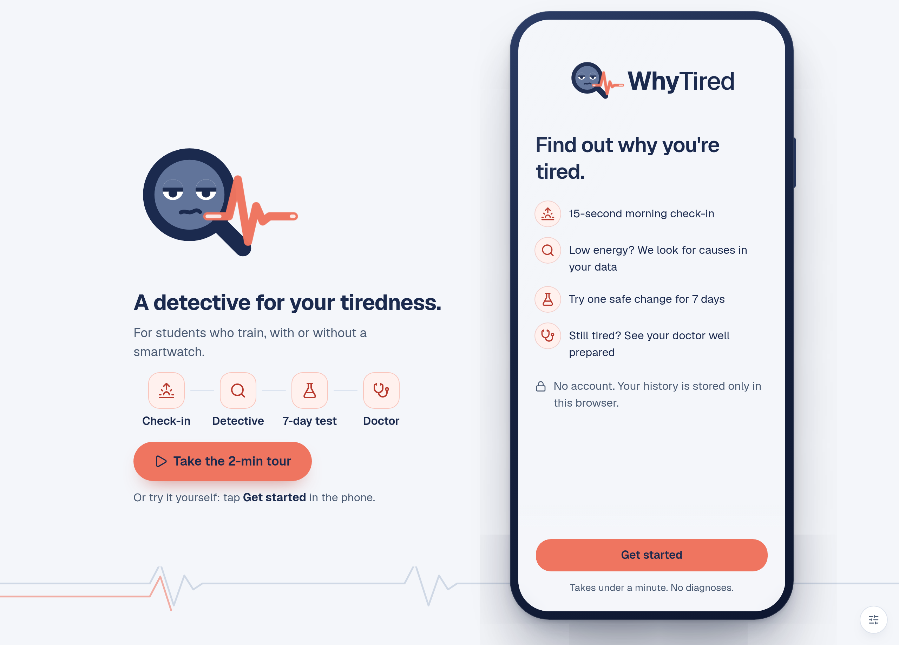
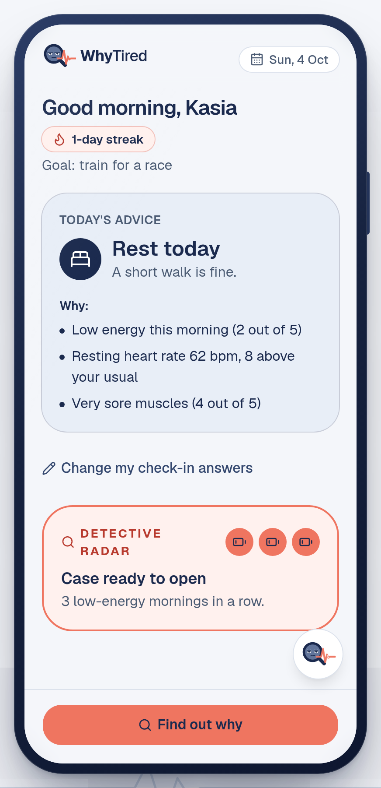
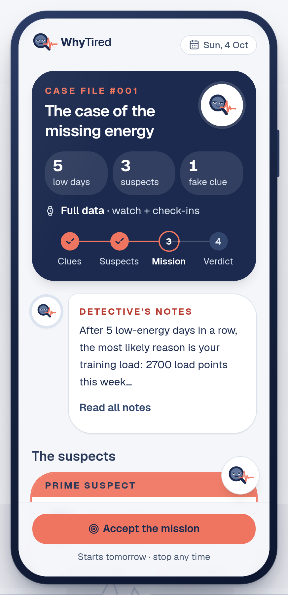
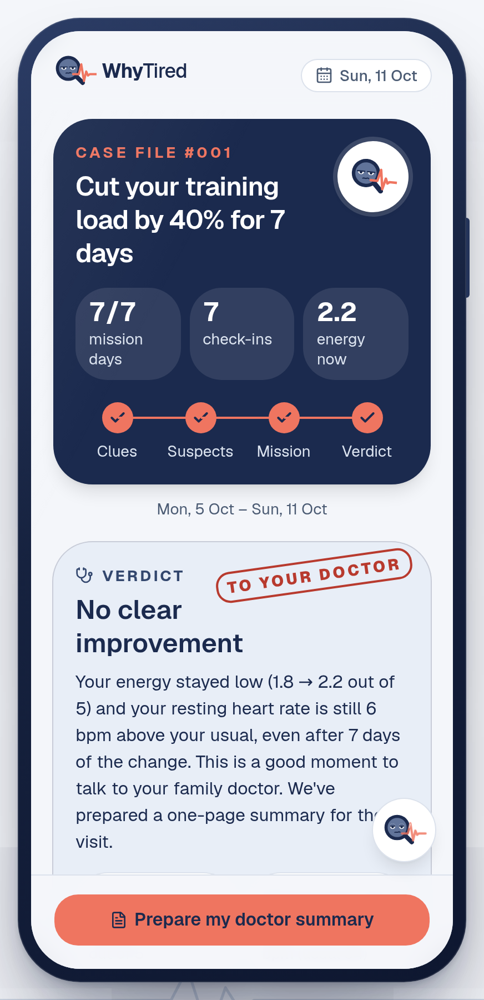
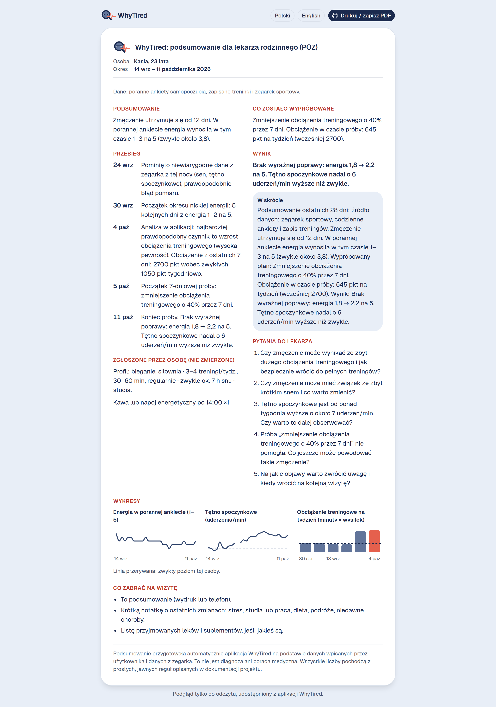
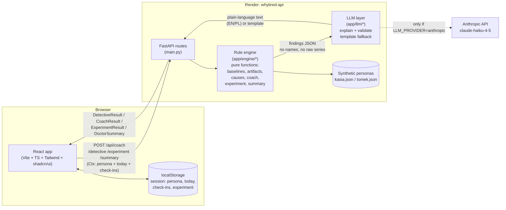

# WhyTired

**For active students and young adults in Poland who train regularly and feel tired without knowing why.**

WhyTired works in three steps:
- A 15-second morning check-in. A daily coach answers it with hard training, easy training or rest.
- When your energy stays low, a *detective mode* looks for likely causes in your own data and shows the evidence and how confident it is.
- It suggests one safe 7-day experiment. If the experiment does not help, it prepares a one-page summary in Polish for your family doctor (POZ).

Built at HackYeah 2026 (Sport & Healthcare).

**Live demo:** https://whytired-vnvu.onrender.com (desktop Chrome works best). Start with **Take the 2-min tour**. The API runs on a free plan and sleeps when idle, so the first screen that needs it can take up to a minute. All data is synthetic: two fictional personas.

## Screenshots


| Morning coach | Detective mode | Experiment result | Doctor summary (PL) |
|---|---|---|---|
|  |  |  |  |

All screens are in `docs/screenshots/`. To regenerate them with both servers running locally, run `node scripts/screenshots.mjs http://localhost:5173 docs/screenshots`.

## Architecture



The backend is stateless: every request carries the full context (persona, "today", logged check-ins, the active experiment) from the browser's `localStorage`, so the free Render API can sleep and wake up without losing anyone's demo. The rule engine is plain Python, no I/O, one small function per rule, and it is the only place that computes numbers. The LLM only turns those numbers into a sentence or two, in English or Polish, and a validator rejects any text that invents a number or mentions a diagnosis, medication or lab test — it falls back to a template if so, or if there is no API key at all.

## Run locally
Needs [uv](https://docs.astral.sh/uv/) (it installs Python 3.12 for you) and Node 22.

```bash
# Backend (Python 3.12 via uv)
cd backend
cp .env.example .env        # LLM_PROVIDER=none works without an API key
uv run uvicorn app.main:app --reload    # http://localhost:8000/api/health

# Frontend (in another terminal)
cd frontend
npm install
npm run dev                 # http://localhost:5173 (proxies /api to :8000)

# Or both in one terminal, from the repo root (Ctrl+C stops both)
node scripts/dev.mjs
```

Tests: `cd backend && uv run pytest`

Demo data (synthetic, deterministic): `cd backend && uv run python -m scripts.generate_personas`

Before the demo, rehearse the whole flow on the live site (Chrome needed):
`node scripts/e2e-demo.mjs https://whytired-vnvu.onrender.com /tmp/whytired-e2e`

And every path a presenter might take (restart, skipping onboarding, both personas, both outcomes):
`node scripts/demo-sweep.mjs https://whytired-vnvu.onrender.com`

## Demo walkthrough

**The 2-minute tour.** On desktop the first screen is a welcome beside the phone with one action: **Take the 2-min tour**. It steps through every screen with one caption each (Next / Back, the arrow keys or a clicker): Kasia (watch) first, then Tomek (no watch), the doctor's page, and the "case closed" ending. It ends with "Try it yourself" or "Watch again". On a phone the tour is a bar above the app.

**On your own.** Tap *Get started* in the phone. A demo tip on the first check-in question says which answer opens the detective, and on the mission screen *Demo: skip to day 7* shows the verdict without waiting a week.

**Presenter tools** (the small icon in the bottom-right corner, or `?presenter=1`) switch the persona, move "today" forward, switch the data level and the experiment outcome, jump between screens, and run the demo script with speaker notes. They stay open in that browser until hidden. "Restart the demo" starts again from onboarding.

The full story, step by step:

1. **Onboarding: open your case file (under a minute).** Five tap-only steps with emoji tiles and a detective mascot that reacts to each answer: goal, sports, training rhythm (sessions per week, session length, how seriously), sleep and the week around it (studies, exams, a job, night shifts…), and what you track with. "Other" takes free text. The device sets the data level (watch → full, phone → medium, nothing → basic). It ends on a case-file card, and the answers reach the doctor summary as one self-reported line.
2. **Morning check-in, one card per question.** Energy, hours slept (prefilled from the watch), sleep quality, stress, soreness, and "I feel ill". A tap answers and moves on. After a short or bad night a follow-up card asks what got in the way (screens, coffee after 2 pm, studying late, worries, alcohol, noise); high stress gets a similar card. Each check-in keeps the streak going (the only reward in the app).
3. **Today.** One verdict (hard / easy / rest) with one-line reasons, a small streak chip, a "detective radar" (low-energy mornings in a row, out of 3), a "Clue spotted" tip when the same clue comes up twice in a week, and an injury-risk check for a planned session (more than 10% longer than the longest one in 30 days). With nothing else due, the primary action is "Rest day done" / "Easy day done" / "Training done" (a rest day counts as much as a hard day).
4. **Detective mode: a case file.** After 3 low-energy mornings, "Find out why" opens *The case of the missing energy*. The suspects (training load spike, sleep debt, stress spike, elevated resting heart rate) are ranked with clue tiles from Kasia's own numbers, an evidence meter with the written confidence (never colour alone), and an "Alibi check" against her own past (her holiday week: energy +1.1, resting HR −6 bpm). The artifact night is stamped "Dismissed" with the reason.
5. **The mission.** The prime suspect proposes one 7-day change (cut training load by 40%). "Accept the mission".
6. **Every new day asks again.** "+1 day" opens the check-in, which now starts with a mission check ("Did you keep yesterday's training light?"). The mission map shows each day as stuck to it / partly / skipped.
7. **The verdict (+7 days).** Days skipped with time travel run on the persona's recorded data and are marked "Demo data". In the not-improved branch the verdict is stamped "To your doctor" and leads to a one-page summary in Polish: complaint timeline, small trend charts, what was tried and how well the plan was followed, what the user noticed (e.g. coffee after 2 pm), and questions to ask. No diagnoses, no recommended tests. Print → PDF fits one A4 page; "Share" gives a read-only link and a QR code. Switch the outcome to "Improved" to see "Case closed" instead; "Keep the change" ends the mission.
8. **Switch persona to Tomek (no watch, basic data).** The same detective runs on check-ins and logged sessions only. A note explains that without a watch no finding goes above medium confidence; his prime suspect is sleep debt during exams.

### Presenting with the demo script (12 scenes, under 2½ minutes)

"Demo script" at the top of the presenter tools runs a scripted version of the story above: Kasia (watch) carries the first half, Tomek (no watch) the second, so every screen is shown once. Each scene loads a complete state, so it always looks the same. The guided tour is the same script with a caption for the audience beside the phone, so on stage the presenter tools are optional: start the tour and click through it.

- **→ / PageDown** next scene, **← / PageUp** previous. A presentation clicker sends these keys.
- The card shows what to say, what to tap live (only the first check-in and the mission check), and the elapsed time against the planned pace (it turns coral when you are more than 10 seconds behind).
- `?scene=N` opens scene N directly, e.g. `https://whytired-vnvu.onrender.com/?scene=5` to recover mid-demo.
- The scenes and the notes live in `frontend/src/lib/scenes.ts`.

| # | Scene | # | Scene |
|---|---|---|---|
| 1 | Kasia's check-in (live) | 7 | Tomek, no watch: same detective, medium confidence |
| 2 | Today: rest, with reasons | 8 | Tomek's mission |
| 3 | Clue spotted + detective radar | 9 | Next morning: mission check (live) |
| 4 | Detective: case file | 10 | A week later: "To your doctor" |
| 5 | Alibi check | 11 | Doctor summary + QR |
| 6 | Fake clue dismissed | 12 | The doctor's page (Polish) |
| ★ | Bonus for Q&A: Kasia's case closed | | |

Rehearse on the live site before presenting: `node scripts/demo-sweep.mjs https://whytired-vnvu.onrender.com` walks 15 presenter paths plus every scene of the script and reports any failure.

## Repository
| Path | What |
|---|---|
| `backend/app/models.py` | Shared data + API contract |
| `backend/app/engine/` | Rule engine: small pure functions, one per rule |
| `backend/app/llm/` | Plain-language explanations with validation and template fallback |
| `backend/scripts/` | Synthetic persona generator |
| `frontend/` | Vite + React + TypeScript + Tailwind + shadcn/ui |
| `docs/PLAN.md` | Build plan, rules, timeline, ownership |
| `docs/DECISIONS.md` | Architecture decisions |
| `docs/DISCLOSURE.md` | AI tools, APIs, libraries, research sources, data statement |

## Team workflow
- `main` is the live demo: every push deploys on Render (static site + API, see `render.yaml`). Run `uv run pytest` and `npm run build` before pushing.
- Boran pushes to `main` directly. Berken works on `feature/<topic>` and opens a PR, and Boran merges it.
